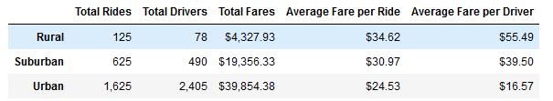
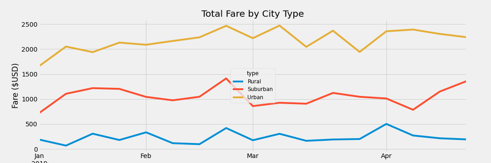

# PyBer Analysis with Pandas and Matplotlib

## Overview of the analysis

### Purpose

Omar and I are working for PyBer, a Python based ridesharing app company. We need to give a presentation to the CEO, V. Isualize, that shows the most recent findings. First, we need to create a summary DataFrame of the ride-sharing data by city type (Urban, Suburban, and Rural) to compare the differences between total rides, total drivers, total fares, average fare per ride, and average fare per driver. We also need a multiple-line chart of the total fares for each city type by month for January through April 2019. 

## Results

## Summary 
