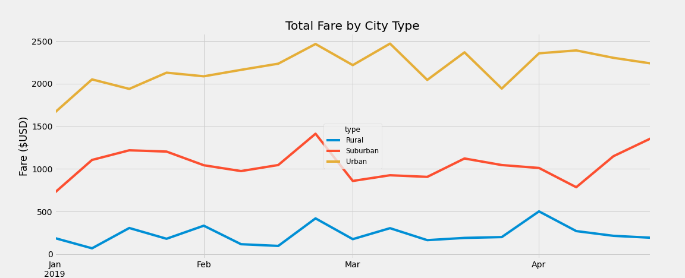

# PyBer Analysis with Pandas and Matplotlib

## Overview of the analysis

### Purpose

Omar and I are working for PyBer, a Python based ridesharing app company. We need to give a presentation to the CEO, V. Isualize, that shows the most recent findings. First, we need to create a summary DataFrame of the ride-sharing data by city type (Urban, Suburban, and Rural) to compare the differences between total rides, total drivers, total fares, average fare per ride, and average fare per driver. We also need a multiple-line chart of the total fares for each city type by month for January through April 2019. 

## Results

As seen in the summary DataFrame, the total number of rides, drivers, and fares goes up from rural, to suburban, to urban cities. This makes sense considering that urban cities will be more populated than suburban and rural. The average fare per ride is highest in rural cities, followed by suburban, and lowest in urban. This makes sense as the distances and times of rides are likely longer in rural cities than urban. Finally, the average fare per driver is highest in rural cities, followed by suburban, and lowest in urban. This doesn't necessarily add up and further investigation may be needed. In the multiple line chart the total fare per month is always highest in urban cities, followed by suburban, and lowest in rural. The total fare per month is about 4x higher on average in suburban than rural, and 10x higher in urban. 

## Summary 

In urban cities there are more total drivers than rides. This must mean that there are some amount of inactive drivers, which are also skewing the average fare per driver value to be lower. Therefore, I would recommend getting rid of any inactive drivers from urban and even suburban and rural cities, or at the very least taking note of them so they aren't included in the summary analysis. The average fare per ride is lower in urban cities, likely because the distances and times of the rides are shorter. If we wanted the average fare per ride to be more equal, then the business should charge higher fares in urban and suburban cities, or lower the fares for rural cities. From January through April, it seems that the total fares for rural and suburban cities are fairly consistent, whereas they increase for urban cities. This could be due to more events happening in urban areas as it warms up. The company could try to offer discounts or work with more events to get more rides in suburban and rural areas. 
